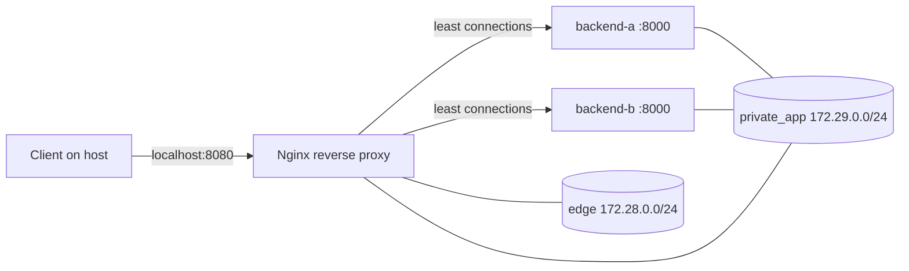

# Cloud Networking Lab

A runnable networking playground for backend, ML-platform and cloud-system interviews. It demonstrates the network primitives that sit underneath AWS VPC, GCP VPC, Azure VNet and Huawei VPC terminology instead of treating cloud networking as a list of vendor products.

## What runs



The backend containers are intentionally attached only to the internal `private_app` Docker network. The proxy is dual-homed: it receives traffic from the edge network and forwards it to private services. This mirrors the public-load-balancer/private-compute pattern used in cloud deployments.

## Quick start

```bash
docker compose up --build
curl http://localhost:8080/whoami
python tools/load_demo.py --requests 200 --concurrency 32
python tools/network_probe.py http://localhost:8080/whoami
```

Repeated `/whoami` calls expose the selected backend so load balancing is observable. `load_demo.py` reports backend distribution, throughput and p50/p95/p99 latency.

## Failure experiments

While the stack is running:

```bash
docker compose stop backend_a
python tools/load_demo.py --requests 50 --concurrency 8

docker compose start backend_a
```

This makes proxy retry/failover behavior visible. The Nginx config uses connection/read timeouts, upstream fail counters and bounded `proxy_next_upstream` retries rather than infinite retry behavior.

## Hands-on labs

| Lab | Demonstrates |
|---|---|
| `01_cidr.py` | IPv4 networks, CIDR membership and subnet splitting |
| `02_tcp_echo.py` | TCP sockets, listening ports, connection establishment and byte streams |
| `app/backend.py` | HTTP application behind a proxy; forwarded headers and instance identity |
| `nginx.conf` | Layer-7 reverse proxy, least-connection balancing, keep-alive and timeout policy |
| `tools/network_probe.py` | DNS resolution → TCP connect → HTTP request timing |
| `tools/load_demo.py` | concurrency, throughput, latency percentiles and backend distribution |
| `docker-compose.yml` | edge/private network segmentation and service discovery by DNS name |

## Interview map

Be able to explain these mappings, not merely memorize them:

- **CIDR / subnet** — address-space boundaries and route domains.
- **Route table** — longest-prefix destination routing decision.
- **NAT** — private clients initiate outbound sessions while remaining unreachable as public endpoints.
- **DNS** — name-to-address resolution and service discovery; Docker DNS here plays the same conceptual role as managed/private DNS in cloud platforms.
- **Security group vs NACL** — stateful resource/interface firewall vs stateless subnet-level ACL in AWS terminology.
- **Reverse proxy vs load balancer** — both can distribute requests; managed cloud load balancers additionally integrate health, TLS, autoscaling and network control planes.
- **ALB vs NLB** — Layer 7 HTTP routing versus Layer 4 TCP/UDP/TLS behavior.
- **TLS termination** — decrypt at the edge or propagate TLS end-to-end depending on trust boundaries.
- **Timeouts/retries** — a reliability policy that must be bounded to avoid retry storms.
- **Private endpoint** — reach managed services without routing traffic through a public internet path.

## Useful commands while the stack is running

```bash
docker compose exec proxy getent hosts backend_a backend_b
docker compose exec proxy cat /etc/resolv.conf
docker network inspect cloud-networking-lab_private_app
curl -v http://localhost:8080/whoami
```

## Quality gates

GitHub Actions runs Ruff, pytest, Docker Compose validation and a container build. The project is intentionally small enough to reason about packet flow at a whiteboard but complete enough to reproduce the topology locally.
